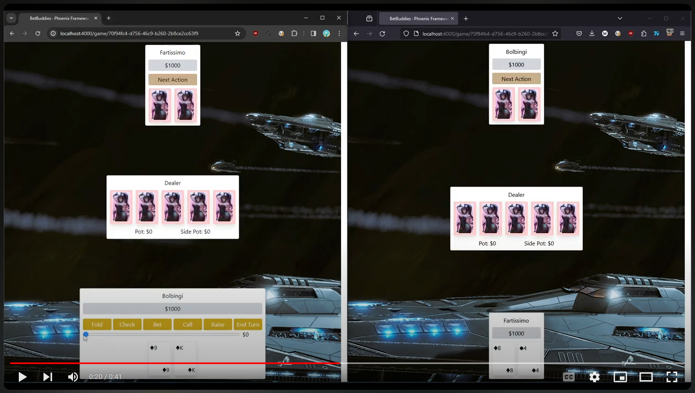

# BetBuddies

## To start it

Make sure you have PostgreSQL installed and running.

See `config/dev.exs` for PostgreSQL configuration.

Run `mix ecto.reset` to set up the database.

To start your Phoenix server:

  * Run `mix setup` to install and setup dependencies
  * Start Phoenix endpoint with `mix phx.server` or inside IEx with `iex -S mix phx.server`

Now you can visit [`localhost:4000`](http://localhost:4000) from your browser.

At [`localhost:4000`](http://localhost:4000) you can create a game or join a game.

You need only your name to create a game. In the URL you'll find a game id like `localhost:4000/game/big-old-long-id`

Give the other player the `big-old-long-id` and with their name, they'll be able to join the game.

Some features are still missing.

# Features
- [x] Game can be created
- [x] Players can join game
- [x] Host can start game
- [x] Players can bet
- [x] Players can check
- [x] Players can call
- [x] Players can fold
- [x] Dealer is plays flop, turn, and river
- [ ] Pot and Side Pot are managed
- [ ] A round of poker can be played
- [ ] Basic functionality has automatic tests
- [ ] Deployed?